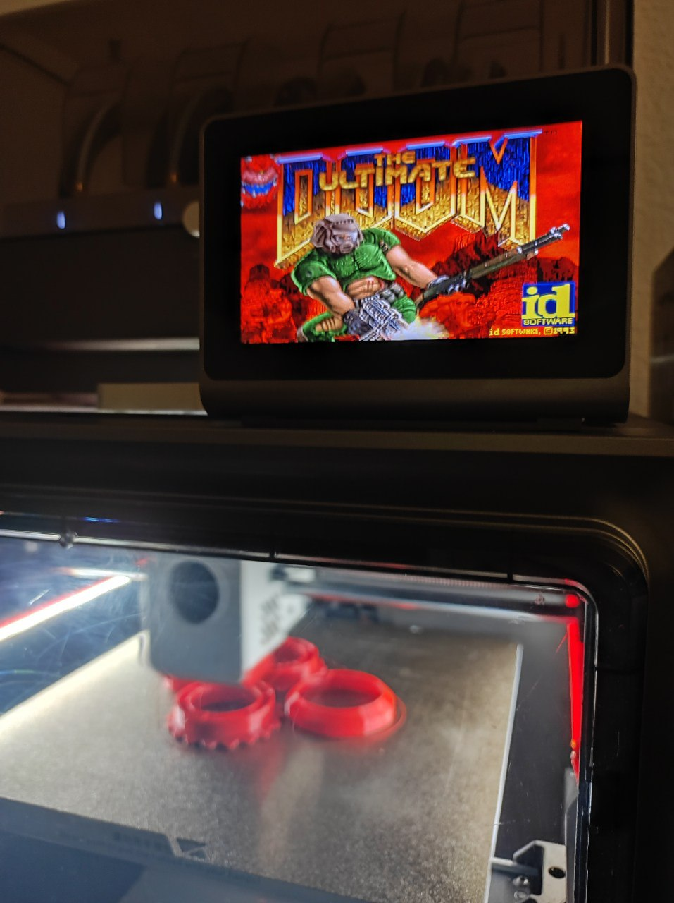

# KobraDoom
doomgeneric port to the Anycubic Kobra S1. To try it you will need a WAD file (game data). If you don't own the game,
shareware version is freely available (e.g. here: [doom1.wad](https://doomwiki.org/wiki/DOOM1.WAD)).



<video src="screenshots/kobra_gameplay.mp4" controls preload></video>

# port
| Functions           | Description                                                             |
|:--------------------|:------------------------------------------------------------------------|
| DG_Init             | Initialize framebuffer and HID device file                              | 
| DG_DrawFrame        | If a frame is ready in DG_ScreenBuffer, it draws it to the frame buffer |
| DG_SleepMs          | Sleep in milliseconds                                                   |
| DG_GetTicksMs       | The ticks passed since launch in milliseconds.                          |
| DG_GetKey           | Provide keyboard events from HID                                        |
| DG_SetWindowTitle   | Not required.                                                           |

All details are in 
[`doomgeneric_kobra.c`](./doomgeneric/doomgeneric_kobra.c) and 
[`Makefile.kobra`](./doomgeneric/Makefile.kobra).

### main loop
Is kept in its simplest form:
```c
int main(int argc, char **argv)
{
    doomgeneric_Create(argc, argv);

    while (true)
    {
        doomgeneric_Tick();
    }
    
    return 0;
}
```

# controls
Via USB HID. Connect a keyboard to the USB port and you're ready to roll. 

# sound
No.

# platforms
The Anycubic Kobra printers are powered by the Rockchip RV1106. The display is controlled via frame buffer. And since
the screen orientation varies across the models this in currently only adapted to the S1.

# prerequisites
- Installed [Rinkhals](https://github.com/jbatonnet/Rinkhals) for SSH access.
- [`task`](https://taskfile.dev/docs/installation) (kinda optional, have a look at [taskfile.yml](taskfile.yml) for `make` commands)
- `make`

# compile
```bash
task [--force # for rebuiild]
task deploy   # to scp binary to kobra printer
task -a       # list available task
```
